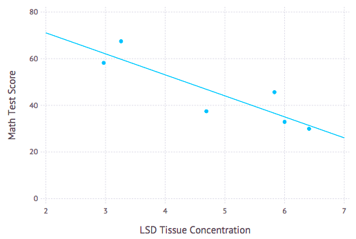

# linear – linear least squares with Go

linear is a Go program to take in a csv file with data only (as numbers,) perform least squares linear regression using batch gradient descent, and return the parameter vector θ of the line of best fit. linear works for data in N dimensions.

As a note – all parameter vectors will be in one more dimension then the number of features, due to a constant term such that x0=1 for θ[0]

## Example Result

This results from the data and commands found below. Graph was plotted using Gadfly in Julia.



#installation

```bash
# from any $GOPATH/src
go get github.com/cdipaolo/linear

# install binaries
go install ./...

# run linear regression:
linear -f='~/data.csv'

# example output #
CSV File Path: /Users/cdipaolo/Data/LSD_Math/lsd.csv
Data: [[1.17] [2.97] [3.26] [4.69] [5.83] [6] [6.41]]
y: [78.93 58.2 67.47 37.47 45.65 32.92 29.97]
DIFFERENCE: 4.271946312592876e+07

Error regressing data:
	Error: regression with learning rate <α = 10> diverging

DIFFERENCE: 4.663658490786932e+06

Error regressing data:
	Error: regression with learning rate <α = 3.3333333333333335> diverging

DIFFERENCE: 2.918613889339043e+08

Error regressing data:
	Error: regression with learning rate <α = 1.1111111111111112> diverging

DIFFERENCE: 2.559111128190052e+06

Error regressing data:
	Error: regression with learning rate <α = 0.3703703703703704> diverging

DIFFERENCE: 1.0929012526650378e+06

Error regressing data:
	Error: regression with learning rate <α = 0.1234567901234568> diverging


j(θ) = 18.134465785768114
Theta with <α = 0.013717421124828532>: [89.0897287015997 -9.002693525546308]

j(θ) = 18.134638299009588
Theta with <α = 0.004572473708276177>: [89.06447864846355 -8.997685017900878]

j(θ) = 18.135157462761608
Theta with <α = 0.0015241579027587256>: [89.02074424297835 -8.989010022127218]

j(θ) = 18.13671294352282
Theta with <α = 0.0005080526342529085>: [88.94517869481557 -8.974021117998445]

j(θ) = 18.141381429497574
Theta with <α = 0.00016935087808430283>: [88.81427951693965 -8.948056438651562]

Final theta with j(θ) = 18.134465785768114
[89.0897287015997 -9.002693525546308] # this is the final parameter vector θ
```

# data formatting

You need to use the basic CSV format, with no text. The last column of your CSV should be the result variable y. All other rows to the left should be a feature variable. This library doesn't check for linearly dependent features yet so check for that before hand and edit your data accordingly.

In this 2 dimensional example (which is the data used for the example graph), the right column is the result, 'Math Test Scores,' and the left column is the input, 'LSD Tissue Concentration' (data set converted to csv from the .dat file on [this](http://www.stat.ufl.edu/~winner/datasets.html) by the way. It is legit :smile:)

```csv
1.17,78.93
2.97,58.20
3.26,67.47
4.69,37.47
5.83,45.65
6.00,32.92
6.41,29.97
```

# TODO

- [ ] add support for stochastic gradient descent as a command line flag
- [ ] implement feature scaling as well as un-scaling before returning θ
- [ ] support other data formats?
- [ ] add build in plotting support to automatically render plots if data is in 2D or 3D

# license – MIT

Copyright 2015 William Conner DiPaolo (@cdipaolo on GitHub) and other contributors

Permission is hereby granted, free of charge, to any person obtaining
a copy of this software and associated documentation files (the
"Software"), to deal in the Software without restriction, including
without limitation the rights to use, copy, modify, merge, publish,
distribute, sublicense, and/or sell copies of the Software, and to
permit persons to whom the Software is furnished to do so, subject to
the following conditions:

The above copyright notice and this permission notice shall be
included in all copies or substantial portions of the Software.

THE SOFTWARE IS PROVIDED "AS IS", WITHOUT WARRANTY OF ANY KIND,
EXPRESS OR IMPLIED, INCLUDING BUT NOT LIMITED TO THE WARRANTIES OF
MERCHANTABILITY, FITNESS FOR A PARTICULAR PURPOSE AND
NONINFRINGEMENT. IN NO EVENT SHALL THE AUTHORS OR COPYRIGHT HOLDERS BE
LIABLE FOR ANY CLAIM, DAMAGES OR OTHER LIABILITY, WHETHER IN AN ACTION
OF CONTRACT, TORT OR OTHERWISE, ARISING FROM, OUT OF OR IN CONNECTION
WITH THE SOFTWARE OR THE USE OR OTHER DEALINGS IN THE SOFTWARE.